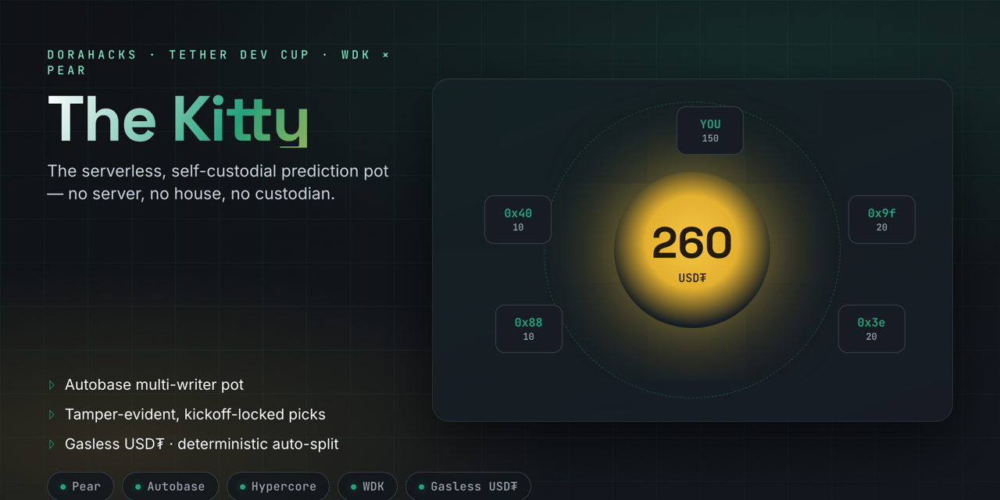
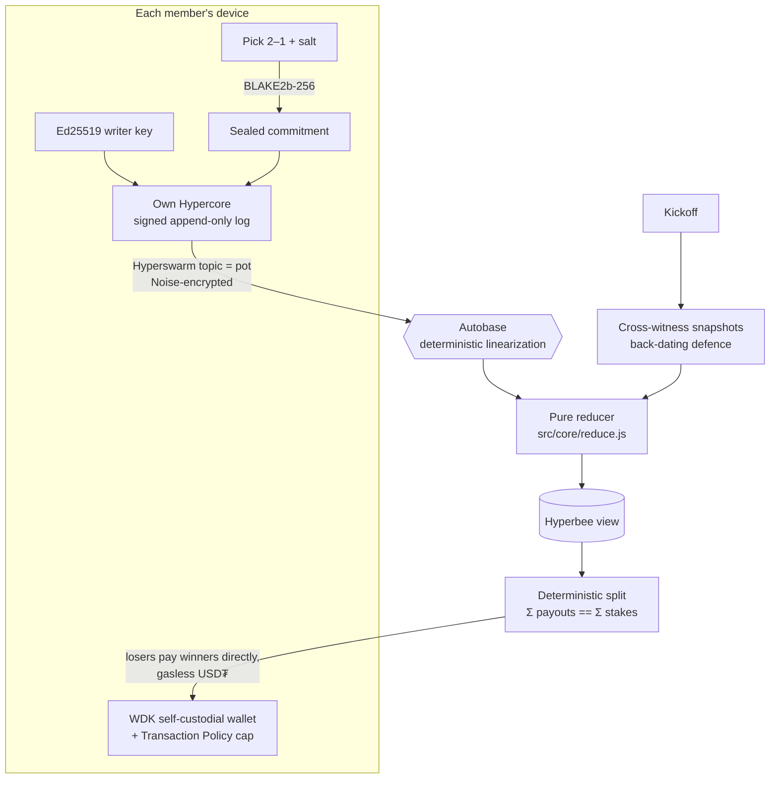

<div align="center">
  
  <h1>The Kitty 🐱⚽</h1>
  <p><em>The serverless, self-custodial prediction pot with no house.</em></p>
  

  <br/>

  [](https://github.com/edycutjong/kitty/actions/workflows/ci.yml)

  [](https://youtu.be/Rx59vsOlg7Q)
  [](https://edycutjong.github.io/kitty/docs/pitch/)

  [](https://dorahacks.io/hackathon/tether-developers-cup)
  [-26A17B?style=for-the-badge)](#-why-only-pear--wdk)

  <br/>

  
  
  
  
  
  [](https://github.com/edycutjong/kitty/actions/workflows/ci.yml)

</div>

---

Every tournament our group chat picks a winner, and every tournament one friend — the "treasurer" — holds everyone's cash, forgets who paid, and someone swears they picked Argentina *before* kickoff. **The Kitty deletes the treasurer, and the argument.** A group stakes USD₮ into a match pot with **no server, no house, and no custodian**; picks are sealed tamper-evidently before kickoff; winners split the pot deterministically.

## 📸 See it in action

Three real peers, one tampering attempt, every invariant checked — this is actual `npm run verify:p2p` output:

```text
[  1.53s] verify   ✓ both joiners admitted with zero manual steps
[  1.55s] ana      WDK Transaction Policy verdict: ALLOW
[  1.58s] ana      pick sealed (commit — salt stays on device)
[  2.30s] verify   ✓ all 3 peers converged on identical pre-kickoff state
[  6.31s] verify   🔒 kickoff — members witnessed each other's logs (back-dating defence armed)
[  6.33s] cai      ⚠ tampering attempt: back-dated commit appended after kickoff
[  6.48s] verify   ✓ result 2–1 finalized by quorum (2 of 3 stakers)
[  6.48s] ben      paid 20 USD₮ → 1db2cfd4… tx DRYRUN-6e2ec7b56a5…

══ INVARIANT REPORT ═══════════════════════════════
  identical state on all 3 peers      ✓
  Σ payouts == Σ stakes (60 == 60)    ✓
  winner set == [ana]                 ✓
  back-dated pick neutralized         ✓
  pot settled, peer-to-peer           ✓
═══════════════════════════════════════════════════
ALL INVARIANTS HELD — no server was harmed (or used) in this demo.
```

> **create pot → gasless stake → picks seal & lock at kickoff → consensus result → deterministic split.** One flow, extreme depth — that is the whole app, on purpose.

## 🚀 Quick start (60 seconds, zero config)

```bash
git clone https://github.com/edycutjong/kitty.git && cd kitty
npm install
npm test              # 227 tests — protocol invariants, P2P convergence, wallet policy
npm run verify:p2p    # 3 live peers + tamper attempt + invariant report (the no-server proof)
npm run bench         # reproducible p50/p95: peer connect, convergence, partition recovery
```

**Play a pot with a friend (or a second terminal):**

```bash
# terminal 1
node bin/kitty.js create --dir /tmp/ana --name ana \
  --match "Brazil vs Argentina" --buy-in 20 --kickoff +5m
# prints:  invite your mates: pear://kitty/4hocdk8k…

# terminal 2
node bin/kitty.js join pear://kitty/4hocdk8k… --dir /tmp/ben --name ben
```

Then at each `kitty>` prompt: `stake` → `pick 2-1` → *(kickoff passes, picks lock automatically)* → `reveal` → `result 2-1` → `settle` → `status`. Try editing a pick after kickoff — watch the ledger reject it in red.

**Desktop app (Pear runtime):** `npm i -g pear && pear run --dev .` — same protocol, floodlit-stadium UI. The CLI is the primary demo path.

## 🧠 How it stays trustless



| Invariant | Enforced by | Tested in |
|---|---|---|
| **Pick immutability** — ≤1 commit/member, sealed pre-kickoff, hash-checked reveal | `src/core/reduce.js` + `src/core/commit.js` | `test/core/reduce.picks.test.js` |
| **Back-dating defence** — a commit no other member witnessed at kickoff never counts | kickoff snapshots, `src/core/selectors.js` | `test/core/reduce.witness.test.js` |
| **Accounting** — `Σ payouts == Σ stakes`, bigint-exact, no house cut | `src/core/split.js` | `test/core/split.test.js`, `settlement.test.js` |
| **Authority** — ops are valid only from the author's own signed Hypercore | Autobase writer model | `test/p2p/convergence.test.js` |
| **Result finality** — strict majority of stakers; ledger freezes at finality | `src/core/reduce.js` | `test/core/reduce.result.test.js` |
| **Determinism** — every peer computes identical state, splits, settlement | pure reducer over linearized log | `test/core/determinism.test.js` |

Full adversary analysis and residual risks: [`docs/AUDIT_REPORT.md`](docs/AUDIT_REPORT.md).

## 💚 Why ONLY Pear + WDK

**Pear (5+ primitives, all load-bearing):** **Autobase** (`src/p2p/pot-base.js`) is the reason there's no server — members write independently, one deterministic reducer linearizes. **Hypercore** signed append-only logs make picks tamper-*evident*, not tamper-argued. **Hyperswarm** (`src/p2p/node.js`) turns a pot ID into an instant room — no signaling server. **Hyperbee** materializes the pot view. **Protomux** (`src/p2p/pairing.js`) multiplexes membership pairing over the same encrypted stream Corestore replicates on.

**WDK (5+ features, all load-bearing):** **self-custodial accounts** (`registerWallet`/`getAccount`/`getAddress` — keys never leave the device), **gasless USD₮ transfers** (fans never need a native token), **Transaction Policies** (`src/wallet/policy.js` — a real ALLOW/DENY engine capping the buy-in; over-cap throws `PolicyViolationError` *before any transaction exists*), **`simulate.transfer`** (policy verdicts without spending — the stake-time guardrail proof), **BIP-39 seed management** (`getRandomSeedPhrase`/`isValidSeed`).

**Take Pear + WDK out and you'd need:** a backend server, a database, a websocket layer, a custodial escrow, a gas faucet, and a server-side limits engine — plus a human to trust with all of it. Two open-source stacks replace six systems and one treasurer.

## 💸 Real-money mode (Solana devnet)

Money is a **signed pledge at stake time, settled peer-to-peer at full-time** — losers pay winners directly, wallet-to-wallet, so no member ever custodies another's funds (see [`DECISIONS.md`](DECISIONS.md) for why this beats a fake "vault").

```bash
cp .env.example .env      # set KITTY_TOKEN_MINT (devnet SPL mint standing in for USD₮)
node bin/kitty.js create … --real
# at settlement, each transfer prints its devnet tx + explorer link
```

Default mode is **dry-run**: fully honest simulation — tx ids are prefixed `DRYRUN-`, labelled in every UI surface, and never presented as on-chain proof. Real-mode explorer links from our demo run will be recorded here before submission (`npm run check:readiness` fails until they are).

## 🧪 Tests & benchmarks

**227 tests** (`npm test`, node:test, no test-framework dependency — verify with `npm run count:tests`):

| Suite | Tests | Covers |
|---|---|---|
| `test/core/` | 158 | every reducer rule, commit-reveal, witnessing, quorum, split math, determinism, invites |
| `test/p2p/` | 7 | live 2-peer convergence, stranger write-rejection, full-flow E2E, real swarm pairing on an in-process DHT |
| `test/wallet/` | 15 | policy engine (real WDK + dry-run twin), transfers, settlement legs, seed handling |

Reproducible performance (`npm run bench`, in-process DHT — isolates the stack from your ISP; M-series macOS, Node 22):

| Metric | p50 | p95 | PRD target |
|---|---|---|---|
| Peer connect (swarm topic) | 4.3 ms | 12.4 ms | < 3 s ✓ |
| Autobase op convergence | 7.4 ms | 13.3 ms | < 1 s ✓ |
| Partition recovery (10 ops) | 10.5 ms | 12.1 ms | < 1 s ✓ |

## 🏗️ Engineering harness

| Layer | Tool | Status |
|---|---|---|
| Code quality | standard (zero warnings) | ✅ |
| Unit + integration tests | node:test — 227 tests | ✅ |
| E2E | `verify_p2p` — 3 live peers, invariant report, runs in CI | ✅ |
| Security (SAST) | CodeQL | ✅ |
| Security (SCA + secrets) | Dependabot + npm audit + TruffleHog | ✅ |
| CI/CD | 5-stage pipeline (quality → security → E2E → bench → gate) | ✅ |
| Performance | `bench.js` p50/p95 artifact on every main push | ✅ |
| Submission honesty | `check_submission_readiness.js` fails on any claim ahead of the build | ✅ |

## ⚠️ Honest limitations

- **Results are consensus-resolved, not oracle-proven.** A colluding quorum of stakers can finalize a wrong score. Deliberate: an AI video oracle would be fragile theatre in a live demo. Documented in `docs/AUDIT_REPORT.md`.
- **Settlement is pledge-based.** A loser refusing to pay is socially enforced — the signed pledge is evidence, the default client auto-settles, but there is no cryptographic escrow yet (that's the roadmap's threshold-escrow).
- **`@tetherto/wdk` is beta** (pinned `1.0.0-beta.12`, API verified from the installed source, not from docs alone). Gasless relay availability on devnet is a network assumption.
- **Witnessing needs one honest online peer at kickoff.** A member alone in a partition can't prove their pick was pre-kickoff (strict mode rejects it; `--witness-rule lenient` trades safety for tolerance).

## 🗺️ What's next

- **Threshold escrow** — replace social settlement with an m-of-n SPL token account so even payment refusal is impossible.
- **Bare mobile build** — same protocol, `bare-kit` iOS/Android, Bluetooth mesh for stadium dead zones.
- **Multi-match season pots** — one Autobase per tournament, standings as a derived view.

## 📁 Layout

```
the-kitty/
├── src/core/      # pure protocol: reducer, commit-reveal, witnessing, split math
├── src/p2p/       # Autobase pot, Hyperbee view, Hyperswarm + pairing
├── src/wallet/    # WDK adapter (real | dry-run), Transaction Policy cap
├── bin/kitty.js   # interactive CLI session (the 2-terminal demo)
├── index.html+app.js  # Pear desktop app
├── scripts/       # bench · verify_p2p · seed_demo · count_tests · readiness gate
├── test/          # 227 tests
├── landing/       # one-page explainer (GitHub Pages-ready)
└── docs/          # AUDIT_REPORT · friction-log · PITCH_DECK · assets
```

## 📄 License, disclosures & acknowledgments

[Apache 2.0](LICENSE) © 2026 Edy Cu — as the Tether Developers Cup rules require. Built on the shoulders of the [Pear stack](https://docs.pears.com) (Holepunch) and the [Wallet Development Kit](https://docs.wdk.tether.io) (Tether). Prior work disclosed: none — every line in this repo was written during the event window.

**Third-party components & services (full disclosure):** open-source packages only — the Holepunch P2P stack (autobase, corestore, hyperbee, hyperswarm, protomux, hyperdht, b4a, z32, sodium-universal) and Tether's `@tetherto/wdk` + `@tetherto/wdk-wallet-solana` (exact pins in `package.json`). External services: the public Hyperswarm DHT bootstrap nodes (peer discovery — replaceable with `--bootstrap` + `scripts/local_dht.js`) and, in `--real` mode only, a public Solana devnet RPC (`api.devnet.solana.com` by default). No cloud AI, no analytics, no hosted backend of any kind.

Thank you for taking the time to review The Kitty. We built the pot we actually wanted for our own group chat — and we're proud there's no server behind it. 🐱⚽
