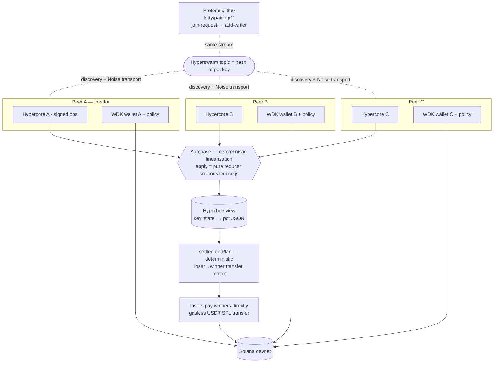

# Architecture — The Kitty

A pot is a **deterministic replicated state machine**: every member appends signed ops to their **own Hypercore**; **Autobase** linearizes all logs into one order; a **pure reducer** folds that order into the pot state every peer computes identically. Money is handled by **WDK** self-custodial wallets and never touches a middleman. There is no server, no database, no cloud — deliberately, structurally, verifiably (`npm run verify:p2p`).

## System diagram



## Layered layout (trust core is I/O-free)

| Layer | Files | Depends on | Tested by |
|---|---|---|---|
| **Core protocol** (pure, no I/O, no clocks) | `src/core/{reduce,selectors,split,commit,hash,invite,constants}.js` | sodium, b4a, z32 | 158 tests |
| **P2P** | `src/p2p/{pot-base,pairing,node}.js` | autobase, corestore, hyperbee, hyperswarm, protomux | 7 integration tests |
| **Wallet** | `src/wallet/{wallet,policy}.js` | `@tetherto/wdk` (dynamic import — ESM), `wdk-wallet-solana` | 15 tests |
| **Surfaces** | `bin/kitty.js` (CLI session) · `index.html`+`app.js` (Pear desktop) · `landing/` | all above | CLI smoke via scripts |

## The op set (the whole protocol)

```
open-pot         { potId, matchId, teams, buyIn, kickoffTs, chain, quorum?, witnessRule? }   creator, once
add-writer       { key, name }                                    any member admits (invite semantics)
stake            { amount == buyIn, payoutAddress, real }         member, pre-kickoff, once — a signed PLEDGE
commit-pick      { commitment = BLAKE2b(potId‖writer‖pick‖salt) } staked member, pre-kickoff, once
kickoff-snapshot { heads: {writerKey: coreLength} }               member, ≤ kickoff+10min grace, once
reveal-pick      { prediction, salt }                             post-kickoff, hash-checked vs commitment
result-vote      { score }                                        staked member, post-kickoff, first vote binding
payout           { transfers: [{to, amount, txid}] }              loser, post-finality, must equal the plan exactly
```

Writer identity comes from **which core the op sits in** (`node.from.key` in the Autobase apply), never from the payload — authority is unforgeable by construction. `node.length` gives each op's sequence number inside its author's log, which is what kickoff snapshots witness.

## The four mechanisms that make it trustless

1. **Commit–reveal picks.** A pick is `BLAKE2b-256(domain‖potId‖writer‖"h-a"‖salt)` before kickoff; the salt stays on the author's device. Nobody can copy a pick they can't see; nobody can change a pick the hash pins. Cross-pot/cross-writer replay is dead because the pot and writer key are in the preimage (`src/core/commit.js`).
2. **Kickoff witnessing.** Op timestamps are author-claimed, so the reducer additionally requires each commit to be **covered by another member's kickoff snapshot** (`snapshot.heads[writer] ≥ commit.seq`, snapshot within the grace window). A "back-dated" commit that surfaces after kickoff has no witness and never becomes eligible — demoed live in `verify_p2p`.
3. **Ledger freeze at finality.** Once a strict majority of stakers votes the identical score, the result finalizes and the reducer rejects any further stake/commit/snapshot/reveal (`ledger-frozen-after-finality`). The split is immutable from that point; late-merging partitions cannot rewrite payouts.
4. **Deterministic net settlement.** `pool = buyIn × stakers`; winners split it by key-sorted remainder distribution (`src/core/split.js`); `settlementPlan` (`src/core/selectors.js`) emits an exact loser→winner transfer matrix via a waterfall over sorted keys. A loser's `payout` op is accepted **only** if its transfers match the plan to the unit. `Σ payouts == Σ stakes` — asserted at runtime, in tests, and in the invariant report.

## Money design: pledge + direct P2P settlement

In a serverless, self-custodial system there is **no escrow address** — any upfront transfer would land in a member's wallet and reinstate the treasurer. So `stake` is a Hypercore-signed pledge whose feasibility is proven by the **WDK Transaction Policy** (`account.simulate.transfer` → ALLOW/DENY verdict, over-cap throws `PolicyViolationError`), and at finality **losers pay winners directly** — gasless SPL transfers, wallet to wallet. Nobody ever holds another member's money. Trade-off (payment refusal is social, not cryptographic) is documented in `docs/AUDIT_REPORT.md`; the upgrade path is a threshold escrow.

Wallet modes are never blurred: `real` (Solana devnet via `@tetherto/wdk@1.0.0-beta.12`, verified against the installed source) vs `dry-run` (deterministic `DRYRUN-…` ids, labelled at every surface, zero-config for judges and CI).

## Determinism contract (Autobase reality)

Autobase may **reorder, truncate, and re-apply** the view as causal forks merge. Therefore:

- the reducer is a pure function of `(state, op, {writer, seq})` — no wall clock, no local knowledge (`'locked'` status is derived at read time, never stored);
- the Hyperbee view holds a single `state` JSON document that `apply` reads, folds, writes back — derived from the linearized nodes and nothing else;
- eligibility/winners/settlement are **selectors** over final state, so late-arriving snapshots settle to the same answer on every peer;
- `test/core/determinism.test.js` replays histories, truncations, and reorderings to pin this down.

## Data & storage

- **Corestore** directory per member device (`<dir>/store`): their writer core + replicas of everyone else's + Autobase system cores.
- **Hyperbee view**: one key (`state`) — pot-scale state is a few KB; O(state) re-apply per batch is deliberate simplicity (documented trade-off).
- **Local secrets**: the sealed pick's `{prediction, salt}` in `<dir>/kitty-local-secrets.json` (CLI) or `localStorage` (desktop app) — never replicated until reveal.
- **Invites**: `pear://kitty/<z32(bootstrap key)>`; the swarm topic is `BLAKE2b('the-kitty/topic:'‖key)` so DHT observers learn a rendezvous point, not the pot key.

## Performance envelope (reproduce with `npm run bench`)

In-process DHT testnet, M-series macOS, Node 22: peer connect p50 **4.3 ms** / p95 12.4 ms · Autobase op convergence p50 **7.4 ms** / p95 13.3 ms · 10-op partition recovery p50 **10.5 ms**. PRD targets (< 3 s connect, < 1 s convergence) hold with two orders of magnitude of headroom.
